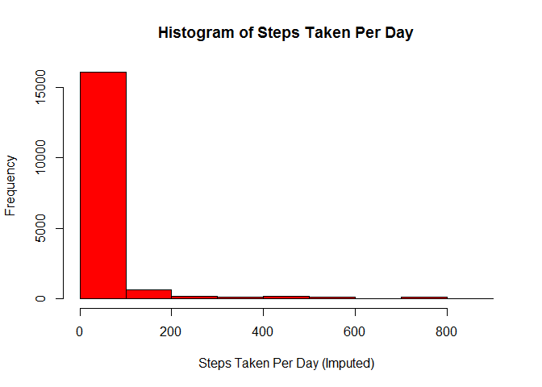

# Reproducible Research: Peer Assessment 1


## Loading and preprocessing the data
Unzip and load the data:


```r
unzip("activity.zip")
data <- read.csv("activity.csv")
```

## What is mean total number of steps taken per day?
Here is a histogram of the steps (using the base plotting system):


```r
hist(data$steps, 
     breaks=10, 
     col="red", 
     main = "Histogram of Steps Taken Per Day",
     xlab = "Steps Taken Per Day",
     ylab = "Frequency")
```

 

Here are the mean and median total number of steps taken per day:

```r
paste("mean:", mean(data$steps, na.rm=T), sep=" ")
```

[1] "mean: 37.3825995807128"

```r
paste("median:", median(data$steps, na.rm=T), sep=" ")
```

[1] "median: 0"

## What is the average daily activity pattern?
Here is a plot of the 5-minute interval and the average number of steps taken, averaged across all days:


```r
group_data <- select(data, steps, interval)
plot_data <- as.data.frame(summarise(group_by(group_data, interval), mean(steps, na.rm=T)))
names(plot_data) <- c("interval", "mean")
plot(plot_data,
     type = "l",
     main = "Average Steps Taken for Interval Across All Days",
     xlab = "5-minute interval",
     ylab = "Average Number of Steps Taken")
```

 

The 5-minute interval, on average across all the days in the dataset, contains the maximum number of steps is:


```r
xtbl <- xtable(filter(plot_data, mean==max(plot_data$mean)))
print(xtbl, type="html", include.rownames=FALSE)
```

<!-- html table generated in R 3.1.1 by xtable 1.7-4 package -->
<!-- Tue Nov 11 16:39:43 2014 -->
<table border=1>
<tr> <th> interval </th> <th> mean </th>  </tr>
  <tr> <td align="right"> 835 </td> <td align="right"> 206.17 </td> </tr>
   </table>

## Imputing missing values
Number of Steps that are NA (17,568 observations):

```r
df <- as.data.frame(table(is.na(data$steps)))
names(df) <- c("", "Count")
xtbl <- xtable(df)
print(xtbl, type="html", include.rownames=FALSE)
```

<!-- html table generated in R 3.1.1 by xtable 1.7-4 package -->
<!-- Tue Nov 11 16:39:43 2014 -->
<table border=1>
<tr> <th>  </th> <th> Count </th>  </tr>
  <tr> <td> FALSE </td> <td align="right"> 15264 </td> </tr>
  <tr> <td> TRUE </td> <td align="right"> 2304 </td> </tr>
   </table>

Proportion of Steps that are NA (17,568 observations):

```r
df <- as.data.frame(prop.table(table(is.na(data$steps))))
names(df) <- c("", "%")
xtbl <- xtable(df)
print(xtbl, type="html", include.rownames=FALSE)
```

<!-- html table generated in R 3.1.1 by xtable 1.7-4 package -->
<!-- Tue Nov 11 16:39:43 2014 -->
<table border=1>
<tr> <th>  </th> <th> % </th>  </tr>
  <tr> <td> FALSE </td> <td align="right"> 0.87 </td> </tr>
  <tr> <td> TRUE </td> <td align="right"> 0.13 </td> </tr>
   </table>

Replacing the NA's with the mean for that 5-minute interval:

```r
data_new <- inner_join(data, plot_data, by="interval")
data_new$steps[is.na(data_new$steps)] <- data_new$mean[is.na(data_new$steps)]
data_new <- data_new[, c("steps", "date", "interval")]
```

Here is a histogram of the steps (using the base plotting system with imputed step counts):


```r
hist(data_new$steps, 
     breaks=10, 
     col="red", 
     main = "Histogram of Steps Taken Per Day",
     xlab = "Steps Taken Per Day (Imputed)",
     ylab = "Frequency")
```

 

Here are the mean and median total number of steps taken per day (with imputed step counts):

```r
paste("mean:", mean(data_new$steps,), sep=" ")
```

[1] "mean: 37.3825995807128"

```r
paste("median:", median(data_new$steps), sep=" ")
```

[1] "median: 0"

Are these new values different than before with the NA values? No, they appear to be exactly the same. As a result, there is no impact to imputing the missing data in this particular data set, using an imputing methodology of replacing the missing values with the mean steps taken for the missing value's corresponding 5-second interval.

```r
paste("mean: ", mean(data_new$steps) - mean(data_new$steps, na.rm=T), sep=" ")
```

[1] "mean:  0"

```r
paste("median: ", median(data_new$steps) - median(data_new$steps, na.rm=T), sep=" ")
```

[1] "median:  0"

## Are there differences in activity patterns between weekdays and weekends?
Comparing plots of the 5-minute interval and the average number of steps taken, averaged across all days, grouped by Weekday/Weekend (using the lattice plotting system):


```r
data_new$weekday <- weekdays(as.Date(data_new$date), abbreviate=T)
data_new$w_flag <- "Weekday"
data_new$w_flag[data_new$weekday %in% c("Sat", "Sun")] <- "Weekend"
group_data_new <- select(data_new, steps, interval, w_flag)
plot_data_new <- as.data.frame(summarise(group_by(group_data_new, 
                                                  interval, w_flag), 
                                         mean(steps)))
names(plot_data_new) <- c("interval", "w_flag", "mean")
xyplot(mean~interval|w_flag, 
       data=plot_data_new, 
       type = "l",
       scales=list(cex=.8, col="red"),
       xlab="5-Second Interval", 
       ylab="Average Steps Taken", 
       main="Weekday vs Weekend Average Steps per 5-Second Interval", 
       layout=c(1,2))
```

 
